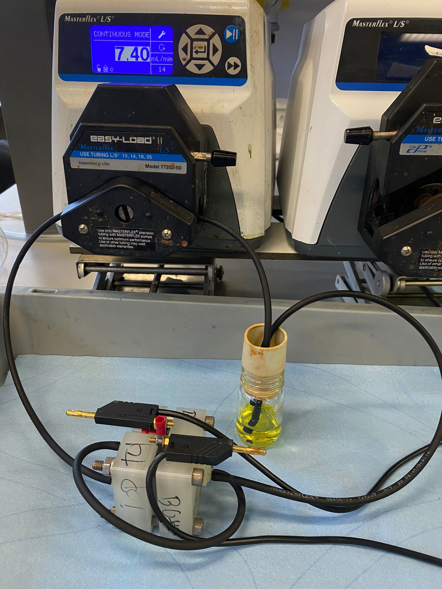
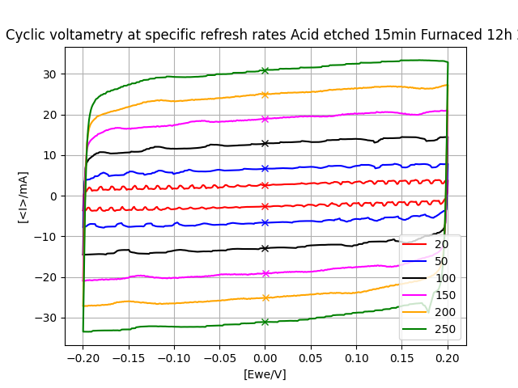
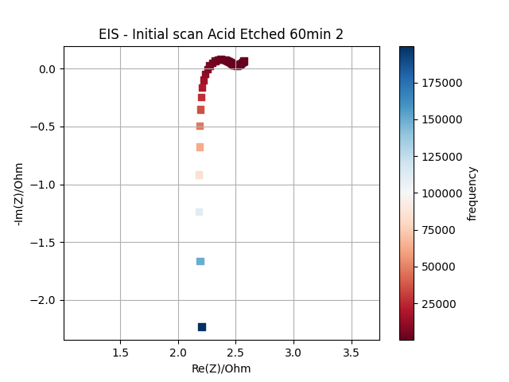
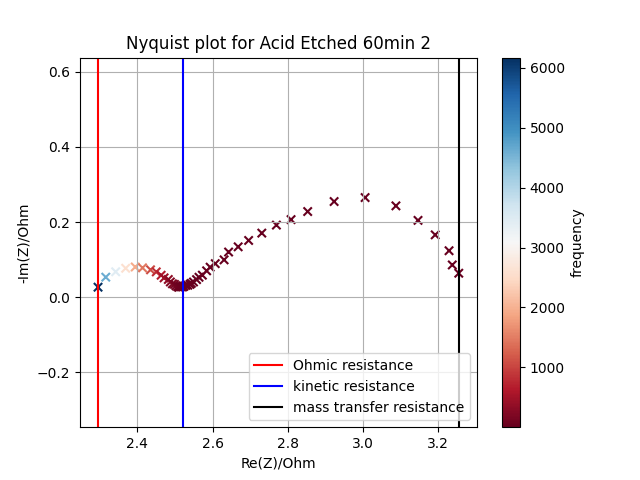
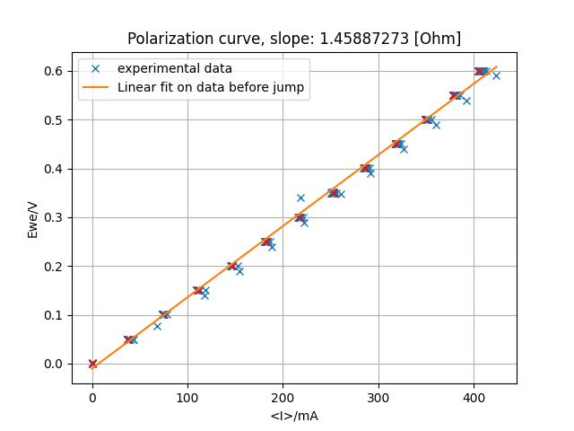

# electrochemical-data-processor
*Note: This is a legacy project from 2023. It is included here to showcase my proficiency in using Python for automated data collection and analysis, as well as my hands-on experience working with redox-flow batteries.*

Tool to automate extraction of ECSA and resistances from CV and PEIS for redox flow battery experiments.
Written in python 3.8.8.



## Overview
* **`data_processor.ipynb`**: Acts as the main execution script that sets up the environment and ensures the necessary local folders (`data` and `results`) exist. It first parses sample names to determine and select the applicable weight for specific electrode treatments by reading from `weight.xlsx`. It then stores the data resulting from the processing via `toolbox.ipynb` in .xlsx files, stored in the `data` folder.
  
* **`toolbox.ipynb`**: Contains the core analytical functions used to process the raw electrochemical data. It performs the mathematical fitting, metric extraction, and automated plotting for:
  *cyclic voltammetry
  *impedance spectroscopy
  *polarization experiments
All the plots containing crucial results are automatically saved as .png in the `results` folder.
  
## Requirements
* **Python 3.8.8** (or newer)
* **pandas** (for data manipulation)
* **numpy** (for numerical operations)
* **scipy** (for signal processing and finding local minima)
* **matplotlib** (for plotting and visualizations)
* **openpyxl** (required by pandas to read `.xlsx` weight files)

## Usage
To start the data processing, create two folders in the repository (`data` and `results`) and also create the .xlsx file containing the weights for each sample (see `example application` for more details). Then place the two Jupyter notebooks in the repository with the experimental files. The experimental files for a specific sample are all to be placed in the same folder containing the sample name. 

```text
📁 repository_root/
├── 📄 data_processor.ipynb
├── 📄 toolbox.ipynb
├── 📄 weight.xlsx
├── 📁 data/
├── 📁 results/
├── 📁 Experiment_01/
│   ├── 📄 CV_test1.txt
│   ├── 📄 PERF_test1_PEIS.txt
│   ├── 📄 PERF_test1_PCGA.txt
│   └── 📄 PERF_test1_PEIS.txt
└── 📁 Experiment_02/
```

## Function Descriptions

* **`weight_calc(sample)`** *(in `data_processor.ipynb`)*: Reads sample string identifiers (e.g., Pristine, Furnaced, Acid Etched, and duration in minutes) and maps them to numerical weights stored in an Excel file.
  
* **`ECSA_calc(loc, fnam)`** *(in `toolbox.ipynb`)*: Extracts Cyclic Voltammetry (CV) data across multiple scan rates (20 to 250 mV/s) and filters out positive and negative current segments to find the average current density near zero potential. It applies a linear 1st-degree polynomial fit to determine the Electrostatic Double-Layer Capacitance (EDLC) and computes the Electrochemically Active Surface Area (ECSA).
  
* **`first_PEIS(loc, fnam)`** *(in `toolbox.ipynb`)*: Reads the initial Potentiostatic Electrochemical Impedance Spectroscopy (PEIS) scan data and generates a baseline Nyquist plot with frequency color-coding to verify half-cell functionality.

* **`second_PEIS(loc, fnam)`** *(in `toolbox.ipynb`)*: Analyzes subsequent PEIS data using a 5th-degree polynomial fit (the data typically forms one or two semi-circles, two semi-circles joined together have exactly two peaks (maxima) and one valley (minimum) between them and a polynomial of degree n can have at most n-1 turning points, so 5th degree should capture all the necessary features) to smooth the experimental noise and reliably detect local minima between impedance arcs. It uses these minima to mathematically approximate and isolate the ohmic, kinetic, and mass transfer resistances.
  
* **`PCGA(loc, fnam)`** *(in `toolbox.ipynb`)*: Processes Potentiodynamic Cycling with Galvanostatic Acceleration (PCGA) polarization data by detecting voltage jumps. It extracts the mean steady-state current and potential for each step, and computes the overall resistance via a linear fit.

## Theoretical Background

This project's main goal was to analyze the physical and electrochemical properties of Freudenberg H23 carbon paper electrodes treated with acid etching (2M $HNO_{3}$) and heat treatment ($450^\circ C$) to maximize wettability for aqueous redox-flow batteries. 

### Cyclic Voltammetry (CV)
Cyclic Voltammetry is used to determine the Electrochemically Active Surface Area (ECSA). The potential is cycled in a small, iron-free region to prevent redox processes and isolate the capacitance behavior. Basically, the current going through the battery is measured as a function of the applied voltage, with this step being repeated at different scanning rates, resulting in a plot as follows:


Then, the current measured at 0 V during the anodic and cathodic sweep is averaged and the Electrostatic Double-Layer Capacitance (EDLC) can be calculated using the following equation:

$$i = \text{EDLC} \frac{dV}{dt}$$

Where $i$ is the averaged current at 0 V and $\frac{dV}{dt}$ is the scan rate. A linear fit of the values of the current against their respective scan rate, results in a function where the EDLC is the slope. The ECSA is then approximated using the area-specific capacitance of carbon materials ($C_{spec} = 23 \mu\text{F/cm}^2$):

$$\text{ECSA} = \frac{\text{EDLC}}{C_{spec}}$$

### Potentiostatic Electrochemical Impedance Spectroscopy (PEIS)
PEIS is used to determine half-cell resistances using frequency excitations that cause negligible potential changes, allowing for impedance measurements without changing oxidation states. On a Nyquist plot, the first real intercept approximates ohmic resistance, the first semi-circle diameter approximates kinetic resistance, and the second semi-circle approximates mass transfer resistance.

In reality, two experiments were needed, one fast experiment to verify the integrity of the redox-flow batter over a large spectrum of frequencies (plot generated by `first_PEIS(loc, fnam)`):


And then a second experiment with a much narrower spectrum of frequencies, where the wanted chart elements can readily be determined (through `second_PEIS(loc, fnam)`):


### Potentiodynamic Cycling with Galvanostatic Acceleration (PCGA)
PCGA is used to determine half-cell performance by mapping measured current against applied potential. A steeper slope indicates that less potential is needed to achieve a certain current, implying better performance. Following Ohm's law ($V = IR$), the overall cell resistance $R$ can be determined dynamically by taking the derivative of the voltage with respect to current:

$$R = \frac{dV}{dI}$$

This is easily determined via a first-order polynomial:


## Results Packaging

* **Data Extraction**: All raw calculations (ECSA values, total polarization resistance, discrete impedance resistances) are returned directly as Python variables or Pandas DataFrames for immediate downstream analysis.
* **Visualizations**: Visual graphs are automatically generated and saved as `.png` image files directly into the `results/` folder. These include annotated CV refresh rate graphs, EDLC linear fit plots, Nyquist plots mapping frequency gradients, and PCGA polarization curves.
